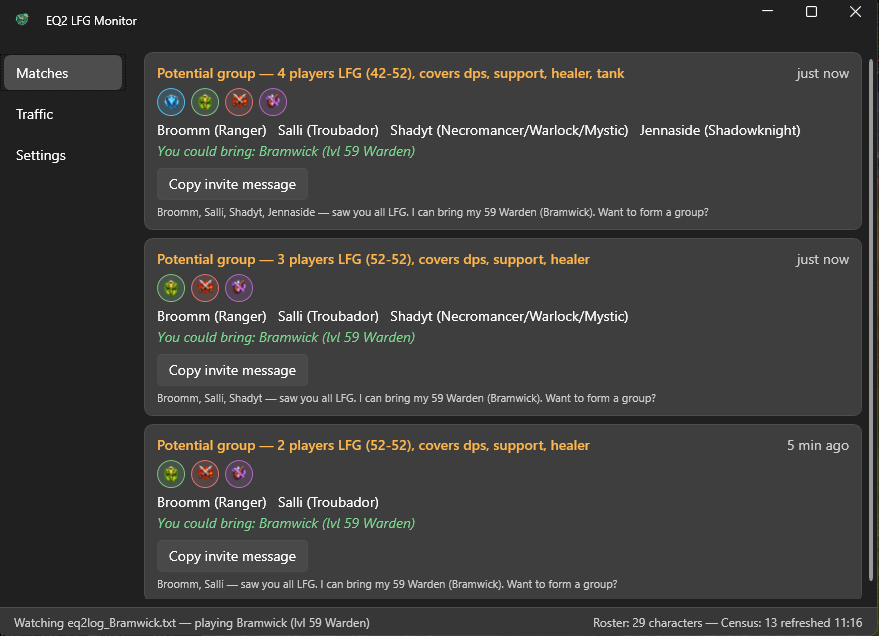

# EQ2 LFG Monitor

A Windows system-tray app (WPF, .NET 8) that watches your EverQuest II chat log and
alerts you when a group advertises needing a role/class/level one of your characters
can fill — or when enough individual LFG players are around to start a new group.

See [REQUIREMENTS.md](REQUIREMENTS.md) for the full feature set.



## How it works

- **Roster** is read from the `*_characters.ini` files in your EQ2 directory
  (all accounts, including EU).
- **Class and level** come from the Daybreak Census API, cached locally in
  `%LOCALAPPDATA%\Eq2Lfg`, with the class chat channel in `*_uisettings.xml`
  as an offline fallback. Level-ups seen in the log update levels live.
- **The active chat log** (`logs\<Server>\eq2log_<Name>.txt`, most recently
  written) is tailed once per second. Requires in-game chat logging
  (`/log`) to be on.
- **Group ads** ("need tank 2 dps CMM") are matched against your enabled
  characters by class, role, and level (zone abbreviations map to level bands
  via an editable zone table). **Player posts** ("52 Warlock LFG") feed a
  group-opportunity detector that alerts when enough compatible players are
  looking at once.
- Alerts: in-app list, Windows toast, and/or a chime — all optional, with a
  per-advertiser cooldown to tame repeat spam.

## Installing

There are no packaged releases yet, so build from source — it's one command:

1. Install the [.NET 8 SDK](https://dotnet.microsoft.com/download/dotnet/8.0)
   (Windows 10 1809+ or Windows 11).
2. Clone and publish:

   ```
   git clone https://github.com/williajm/eq2_lfg.git
   cd eq2_lfg
   dotnet publish src/Eq2Lfg.App -c Release -o publish
   ```

3. Run `publish\Eq2Lfg.App.exe`. Closing the window minimizes to the tray;
   use Exit on the tray icon's menu to quit.
4. Optional: to start it with Windows, put a shortcut to the exe in the folder
   that opens when you run `shell:startup`.

## First-run setup

1. **Turn on chat logging in EQ2**: type `/log` in game. Without it the game
   never writes the chat log this app tails.
2. **EQ2 directory**: auto-detected on first launch. If detection fails, open
   Settings → EQ2 directory and click Detect or paste the install path.
3. **Characters**: Settings → Available characters lists every character found
   across your accounts. Untick any account, server, or character you don't
   want matched.
4. **Alerts**: pick your mix of Windows toasts, chime, and in-app highlights.
5. **Optional — Census service ID**: with many characters, register a free
   service ID at census.daybreakgames.com and set it in Settings to lift the
   anonymous API rate limit (see below).

## Building for development

```
dotnet build Eq2Lfg.sln
dotnet test tests/Eq2Lfg.Core.Tests
```

## Quality gates

- **CI** (`.github/workflows/ci.yml`): `dotnet format --verify-no-changes`,
  build with warnings-as-errors, and unit tests on every push/PR.
- **CodeQL** (`codeql.yml`): C# security/quality analysis on pushes, PRs, and
  a weekly schedule.
- **SonarCloud** (`sonarcloud.yml`): skips until you finish the one-time setup —
  sign in at sonarcloud.io with GitHub, import this repo, and add a
  `SONAR_TOKEN` repository secret (free for public repos).
- **Branch protection**: PRs into `main` must pass the `build` and
  `Analyze (csharp)` checks and be up to date with `main`.

## Census rate limit

Anonymous Census API access allows ~10 lookups/minute. The app stays under it
(stale-entry-only refreshes, not-found caching, backoff), but if you have many
characters you can register a free service ID at census.daybreakgames.com and
set it in Settings to lift the limit.

## Configuration

Settings live in `%LOCALAPPDATA%\Eq2Lfg\settings.json` and are all editable from
the app's Settings view: alert styles, cooldown, level tolerance, EQ2 directory,
the account → server → character availability tree, and the zone table
(`zones.json`, seeded for EoF-era Wuoshi).
